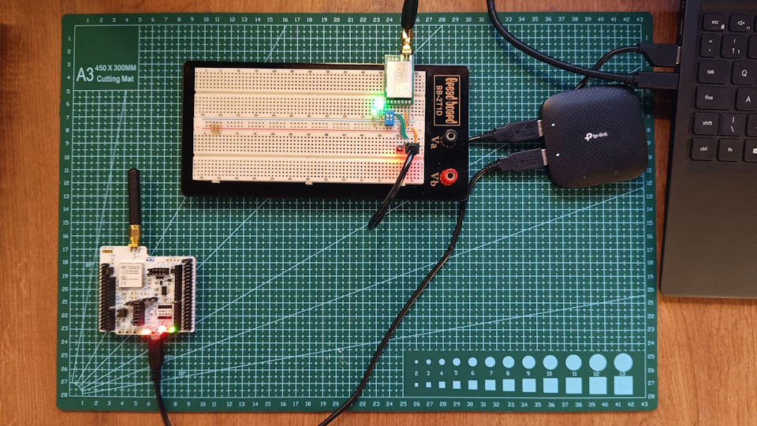
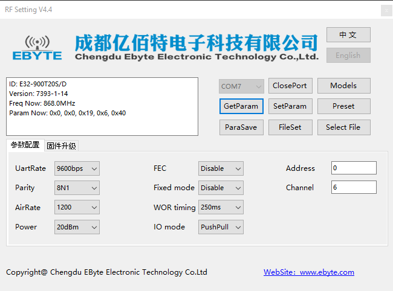
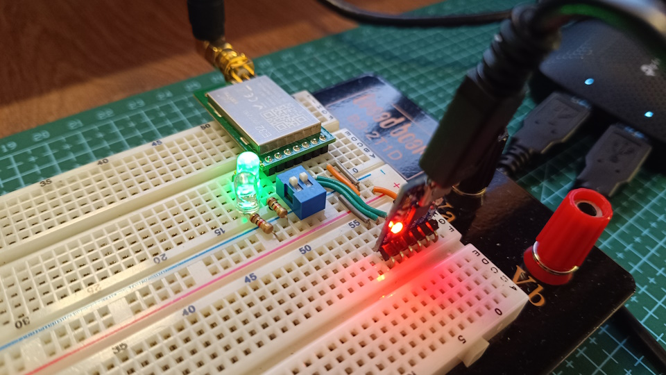
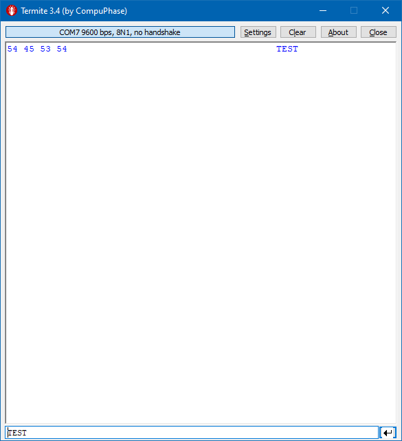
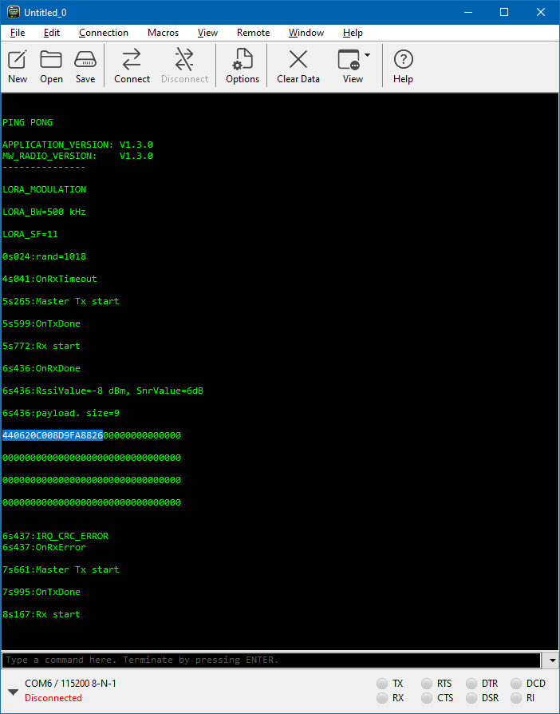
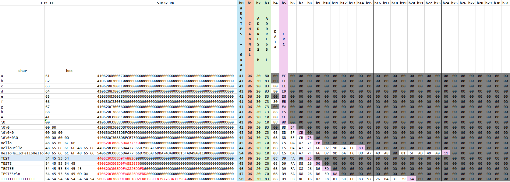
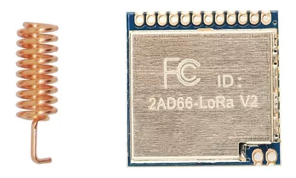

# LoRa communication: STM32WL55JC1 and E32-900T20D

This small project is an atemp to test LoRa communication between a [Nucleo WL55JC1](https://www.st.com/en/evaluation-tools/nucleo-wl55jc.html) 
([STM32WL55JC](https://www.st.com/en/microcontrollers-microprocessors/stm32wl55jc.html) from ST Microelectronics) and an 
EBYTE [E32-900T20D](https://www.cdebyte.com/products/E32-900T20D/1) LoRa/UART module 
([SX1276](https://www.semtech.com/products/wireless-rf/lora-connect/sx1276) from Semtech).  
  
 
  
The Nucleo board is running a modified example from ST's repository that can be found on CubeMX, 
named "[SubGHz_Phy_PingPong](https://github.com/STMicroelectronics/STM32CubeWL/tree/7950099d0d2502f55ac8e189270119800af4dd55/Projects/NUCLEO-WL55JC/Applications/SubGHz_Phy/SubGHz_Phy_PingPong)".  
The changes, necessary to match the configuration of the LoRa transceivers, were:  
@file    subghz_phy_app.h:
```
#if (( USE_MODEM_LORA == 1 ) && ( USE_MODEM_FSK == 0 ))
#define LORA_BANDWIDTH                2        /* [0: 125 kHz, 1: 250 kHz, 2: 500 kHz, 3: Reserved] */
#define LORA_SPREADING_FACTOR        11        /* [SF7..SF12] */
#define LORA_CODINGRATE               1        /* [1: 4/5, 2: 4/6, 3: 4/7, 4: 4/8] */
#define LORA_PREAMBLE_LENGTH          8        /* Same for Tx and Rx */
#define LORA_SYMBOL_TIMEOUT           5        /* Symbols */
#define LORA_FIX_LENGTH_PAYLOAD_ON    false
#define LORA_IQ_INVERSION_ON          false
```

And also these, to facilitate debug:  
@file    sys_conf.h:  
```
#define VERBOSE_LEVEL                 VLEVEL_H
#define DEBUGGER_ENABLED              1
#define LOW_POWER_DISABLE             1
```
  
The E32 module is configured as follows, and it is running in Normal mode (M0 and M1 in LOW):  
  
  
  
   
  
Therefore, the LoRa configuration in this test is: 
- Frequency:         868 MHz
- Bandwidth:         500 kHz
- Spreading factor:  SF11
- Coding rate:       4/5  
    
The E32 module is then connected to the PC via a UART/USB converter and data can be sent manually using a terminal application 
(in this case, I'm using [Termite](https://www.compuphase.com/software_termite.htm) for the E32 - **COM7**).  
  
 
  
The Nucleo board is also connected to the PC and the ST-Link also includes a COM port connected to the MCU's UART. 
With modifications shown before, 
running the software on the Nucleo board and connecting a terminal to the UART 
(in this case, [CoolTerm](https://freeware.the-meiers.org/) - **COM6**), 
it is possible to see when messages from the E32 module are received by the STM32. 
To improve reception from the STM32, 
the message from the E32 should be sent as soon as the STM32 starts its RX cycle 
(the following message is sent from STM32 via UART: "*elapsed time*:Rx start").  
  
 

However, as highlighted on the image above, 
data sent from the E32 module is encrypted and packaged with more information 
regarding the length, channel, address, and some type of checksum/CRC calculation.  
I didn't find information about this encryption on the module's datasheet, 
but after some research I've found some interesting clues of how data is treated.  
[This discussion](https://github.com/sandeepmistry/arduino-LoRa/issues/203) is very helpful and also led me to 
[this blog post](https://www.sanglierlab.fr/2023/02/11/communiquer-entre-un-module-ebyte-e32-et-un-module-ra01-02-sx1278/).  

Now I'm stuck at this point, because my encrypted message does not seem to follow the same rule as shown in the posts referenced above.  
From there, the "TEST" message should be encrypted as (in Hex): 44 06 00 00 E7 F6 E0 E7 01. 
Maybe the exact values could be different, due to a different key, 
and the last byte (CRC) would most likely be different, but notice that "TEST" has two "T"s and that encrypted message has "0xE7" twice.  
This is not the case in my messages, as they do not repeat bytes (for "TEST" I get: 44 06 20 C0 08 D9 FA 88 26).  
  
I tried several test messages, and they are consistently delivered to the STM32 (if I repeat the message on the E32, I get exactly the same response from the STM32), 
but they seem to have a different encryption - or my radio settings are incorrect, and data is getting corrupted due to a misinterpretation by the STM32 radio.  
  
Here are some tests and responses I recorded:  
  
  
  
# Next steps  
  
I'll try next:  
- Get another E32 module to serve as a sniffer and validate what the 1st E32 module is sending;  
- Get another LoRa module, based on the same IC (SX1276), but with SPI interface and access to radio parameter similar to what is available on the STM32 (BW, SF, CR, etc.) and not the "high level" parameters available on the E32 module (channel, air rate, etc.). From what I read, this module also does not have the encryption of data, so communication should be simpler.
  
  
